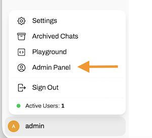
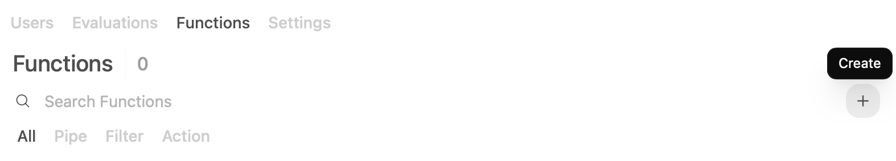
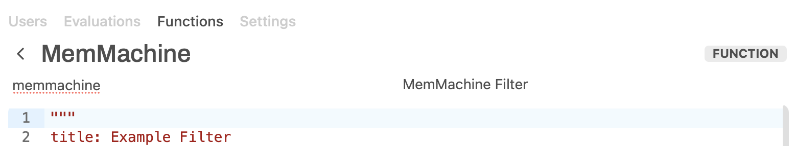
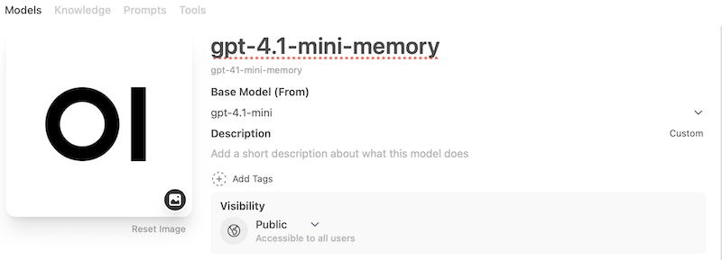

# MemMachine Docker Setup Guide

## Quick Start

### Prerequisites
- Docker and Docker Compose installed
- OpenAI API key configured

### 1. Configure Environment
Copy the example environment file and add your OpenAI API key:
```bash
cp sample_configs/env.docercompose .env
# Edit .env and add your OPENAI_API_KEY

```

### 2. Configure MemMachine
Copy the sample configuration file and update it with your settings:
```bash
cp sample_configs/episodic_memory_config.sample configuration.yml
# Edit configuration.yml and update:
# - Replace <YOUR_API_KEY> with your OpenAI API key
# - Replace <YOUR_PASSWORD_HERE> with your Neo4j password
# - Update host from 'localhost' to 'neo4j' for Docker environment
```

### 3. Start Services
Run the startup script:
```bash
./start-docker.sh
```

This will:
- ✅ Check Docker and Docker Compose availability
- ✅ Verify .env file and OpenAI API key
- ✅ Pull and start all services (PostgreSQL, Neo4j 5.23, MemMachine)
- ✅ Wait for all services to be healthy
- ✅ Display service URLs and connection info

### 4. Access Services
Once started, you can access:

- **MemMachine API**: http://localhost:8080
- **Neo4j Browser**: http://localhost:7474
- **Health Check**: http://localhost:8080/health
- **Metrics**: http://localhost:8080/metrics

### 5. Test the Setup
```bash
# Test health endpoint
curl http://localhost:8080/health

# Test memory storage
curl -X POST "http://localhost:8080/v1/memories" \
  -H "Content-Type: application/json" \
  -d '{
    "session": {
      "group_id": "test-group",
      "agent_id": ["test-agent"],
      "user_id": ["test-user"],
      "session_id": "test-session-123"
    },
    "producer": "test-user",
    "produced_for": "test-user",
    "episode_content": "Hello, this is a test message",
    "episode_type": "text",
    "metadata": {"test": true}
  }'
```

## Useful Commands

### View Logs
```bash
docker-compose logs -f
```

### Stop Services
```bash
docker-compose down
```

### Restart Services
```bash
docker-compose restart
```

### Clean Up (Remove All Data)
```bash
docker-compose down -v
```

## Services

- **PostgreSQL** (port 5432): Profile memory storage with pgvector
- **Neo4j** (ports 7474, 7687): Episodic memory with vector similarity
- **MemMachine** (port 8080): Main API server (uses pre-built `memmachine/memmachine` image)

## Configuration

Key files:
- `.env` - Environment variables
- `configuration.yml` - MemMachine configuration
- `docker-compose.yml` - Service definitions
- `start-docker.sh` - Startup script

## OpenWebUI config

Once OpenWebUI is up and running, create an admin account.

### Admin Panel

Open the Admin Panel.



#### Filter Function

Head to *Functions* in the top menue.



Copy the content of the [filter.py](./examples/functions/filter.py) file and paste it into a new function under the *Admin Panel*.  
Provide a meaningful name and description and save.



⚠️ make sure you enable the function after you created it.


#### OpenAI Token

To get access to the OpenAI API, go to **Settings** > **Connections** and add your OpenAI API Token.


### Workspace

#### `gpt-4.1-mini-memory`

Next we head to **Workspace** on the left menue and create a new model, which uses the Filter Function.



1. Give it a name at the top
1. select a base model
1. make it public so that usual users can use it.


Select the filter you just created.

## ⚠️ Important Configuration Notes

**1. Database Configuration Consistency**
Make sure the database configuration details in `configuration.yml` match the database configuration details in `.env`

Both files must have consistent:
- Database hostnames (use service names: `postgres`, `neo4j`)
- Database ports (5432 for PostgreSQL, 7687 for Neo4j)
- Database credentials (usernames and passwords)
- Database names

**2. Configuration.yml Setup**
The `configuration.yml` file contains MemMachine-specific settings:
- **Model configuration**: OpenAI API settings for LLM and embeddings
- **Storage configuration**: Neo4j connection details
- **Memory settings**: Session memory capacity and limits
- **Reranker configuration**: Search and ranking algorithms

**Key settings to update in configuration.yml:**
- Replace `<YOUR_API_KEY>` with your OpenAI API key (appears in both Model and embedder sections)
- Replace `<YOUR_PASSWORD_HERE>` with your Neo4j password
- Ensure the Neo4j host is set to `neo4j` (not `localhost`) for Docker environment

This ensures MemMachine can properly connect to the Docker services and use your OpenAI API key for embeddings and LLM operations.
